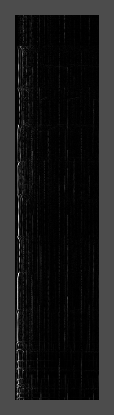
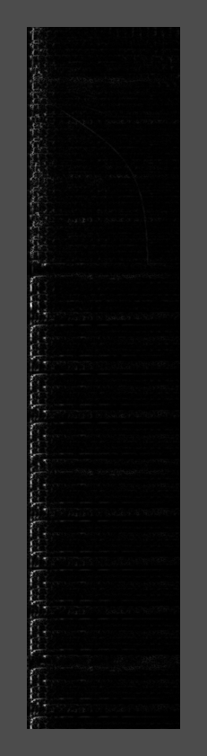

# sound-visualiser (name to be determined)

sound-visualizer aims to procude 3d images (render or real time) of sound files. It will display the frequency domain. 
the 3rd dimension will be time.

Currently, it generates spectrogram of wholes track, as greyscale images. It can be used as a CLI tool, or as a web app. 

## Installation

You will need to have [Poetry](https://python-poetry.org/) installed.

```$ poetry install```


You can also use docker. There is an image on dockerhub [here](https://hub.docker.com/repository/docker/lucleonard/sound-visualizer)
You can also make your own image by using

```$ make docker```

## Usage
### as a CLI tool
#### the arguments
* --filename <filename>: the wav to analyse
* --frame_size: the size of the frames that will be used for the FFT transform. It should be a power of 2 such as 1024 or 2048
 You should make it higher if you want to analyse lower frequencies.
* --overlap_factor: how much the frames will overlap ? the more, the better, but the more memory it will use
* --start: where to start in the wav, in seconds
* --length: how much second of sound to analyse
* --low-cut:  this will ignore lower frequencies when displaying data
* --high-cut: this will ignore higher frequencies when displaying data
* --output-folder: where to output the images

```$ poetry run sound_visualizer_main.py <args>```

### as a web server
#### directly
run ```make start_webserver``` and go to http://localhost:5000
#### with docker

You can use ```docker run -p 5000:80 lucleonard/sound-visualizer``` and go to http://localhost:5000

The web application is also deployed at https://luc-leonard-sound-visualizer.herokuapp.com/

## Examples



## Contributing
For now, it is just a personal repository :) feel free to fork it anyway.
