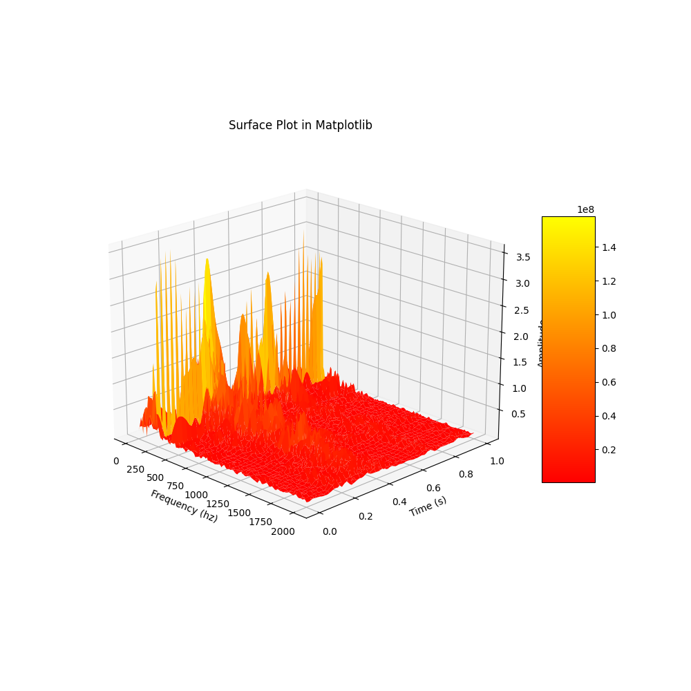
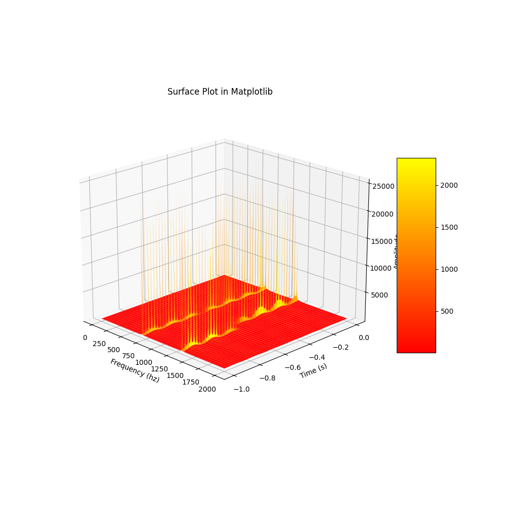

# sound-visualiser (name to be determined)

sound-visualizer aims to procude 3d images (render or real time) of sound files. It will display the frequency domain. 
the 3rd dimension will be time

## Installation

You will need to have Poetry installed.
```$ poetry install```


You can also use docker. the image is not currently on dockerhub, but you can build it yourself:
```$ docker build . -t <image_name>```

## Usage
### the arguments
* --filename <filename>: the wav to analyse
* --frame_size: the size of the frames that will be used for the FFT transform. It should be a power of 2 such as 1024 or 2048
 You should make it higher if you want to analyse lower frequencies.
* --overlap_factor: how much the frames will overlap ? the more, the better, but the more memory it will use
* --start: where to start in the wav, in seconds
* --length: how much second of sound to analyse
* --low-cut:  this will ignore lower frequencies when displaying data
* --high-cut: this will ignore higher frequencies when displaying data
* --output-folder: where to output the images
### With poetry: 
```$ poetry run sound_visualizer_main.py <args>```
### With Docker
```$ docker run -i luc-leonard/sound-visualizer:latest $ARGS < $PATH_TO_WAV > $PATH_TO_IMG ```

## Examples



## Contributing
For now, it is just a personal repository :) feel free to fork it anyway.
